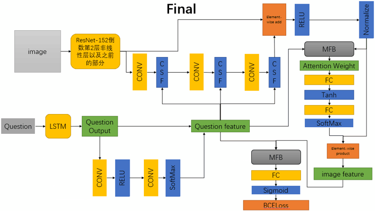

# 毕业设计
对于视觉问答（VQA）的研究具有深刻的学术意义和广阔的应用前景。目前，视觉问答模型性能提升的重点在于图像特征的提取，文本特征的提取，attention权重的计算和图像特征与文本特征融合的方式这4个方面。本文主要针对attention权重的计算和图像特征与文本特征融合这两个方面，以及其他细节方面的地方相对于前人的模型做出了改进。本文的主要工作在于本文使用open-ended模式，答案的准确率采用分数累积，而不是一般的多项选择。本文采用CSF模块（包括CSF_A和CSF_B）不仅对spatial-wise进行了权重计算，还对channel-wise进行了权重计算。本文采用MFB模块和ResNet152 FC层之前的tensor来结合LSTM的输出来计算每个区域的权重，而不是直接把image feature和question feature结合本文采用SigMoid来计算最后的分布，而不是一般的softmax(实验部分会有对比两者的差异)。

# 总体模型的架构

